  

  
  
  
  

  

## About me

I'm a software engineer and research assistant based in **Cluj-Napoca, Romania**. I enjoy working where software meets the physical world: native Linux applications, C++/Qt interfaces, computer-vision and AI integrations, backend systems, realtime mobile clients, and connected devices.

- 🎓 Computer Science graduate and current master's student at **Babeș-Bolyai University**, focused on high-performance computing and large-scale data.
- 🔬 Building production-facing software with **C++17, Qt 6/QML, OpenCV, OpenVINO, Python, and Linux**.
- 🧩 Interested in **systems programming, software architecture, distributed systems, AI integration, and reliable backend engineering**.
- 🐧 Daily-driving Fedora Linux and happiest when a project crosses boundaries between UI, services, operating systems, data, and hardware.
- 🤝 Open to software engineering opportunities, research collaborations, and carefully scoped freelance projects.

## Featured work

<table>
  <tr>
    <td width="50%" valign="top">
      <h3>🛡️ <a href="https://github.com/Rotciv004/AtlasVeil-VPN">AtlasVeil VPN</a></h3>
      Native Fedora/KDE controller for saved WireGuard profiles. It talks to NetworkManager over D-Bus, models asynchronous connection states, separates the OS backend from the UI, and includes deterministic controller tests.
        
      <code>C++23</code> <code>Qt 6</code> <code>QML</code> <code>Kirigami</code> <code>NetworkManagerQt</code> <code>CMake</code> <code>Qt Test</code>
    </td>
    <td width="50%" valign="top">
      <h3>🩺 <a href="https://github.com/Rotciv004/Digital_Triage">Digital Triage</a></h3>
      Role-based medical platform for patients and clinicians, with medical records, file attachments, hospital management, triage data, permission-aware analytics, and automated tests in a layered architecture.
        
      <code>.NET 8</code> <code>Blazor Server</code> <code>EF Core</code> <code>SQL Server</code> <code>MySQL</code> <code>xUnit</code> <code>Moq</code>
    </td>
  </tr>
  <tr>
    <td width="50%" valign="top">
      <h3>🌱 Smart Irrigation Ecosystem</h3>
      End-to-end connected-device project: an <a href="https://github.com/Rotciv004/Smart-Irrigation-System">ESP32 irrigation controller</a> with soil sensing and hysteresis-based pump control, paired with a <a href="https://github.com/Rotciv004/Smart-Irrigation-App">local-first Android application</a> for monitoring and control over HTTP.
        
      <code>Kotlin</code> <code>Jetpack Compose</code> <code>MVVM</code> <code>StateFlow</code> <code>Retrofit</code> <code>ESP32</code> <code>Arduino</code>
    </td>
    <td width="50%" valign="top">
      <h3>🛒 <a href="https://github.com/Rotciv004/Shopping-List-Sharing-App-Flutter">Shopping List Sharing</a></h3>
      Cross-platform collaborative shopping lists with groups, budgets, priorities, deadlines, item claiming, and live updates. A Flutter client communicates with a .NET 8 backend through HTTP and SignalR.
        
      <code>Flutter</code> <code>Dart</code> <code>Riverpod</code> <code>.NET 8</code> <code>SignalR</code> <code>Dapper</code> <code>SQL Server</code>
    </td>
  </tr>
  <tr>
    <td width="50%" valign="top">
      <h3>🐗 <a href="https://github.com/Rotciv004/BOAR_programming_Language">BOAR Programming Language</a></h3>
      Experimental language and web IDE featuring an ANTLR lexer, a hand-written LL(1) parser, FIRST/FOLLOW table construction, production tracing, and father-sibling parse-tree visualization.
        
      <code>C#</code> <code>.NET 10</code> <code>ANTLR</code> <code>LL(1)</code> <code>Blazor</code> <code>Compiler Design</code>
    </td>
    <td width="50%" valign="top">
      <h3>🧠 <a href="https://github.com/Rotciv004/Artificial-Intelligence">AI & Numerical Experiments</a></h3>
      Jupyter-based implementations covering classical search, Monte Carlo simulation, numerical optimization, neural networks, convolution, pooling, and introductory computer vision with PyTorch.
        
      <code>Python</code> <code>Jupyter</code> <code>PyTorch</code> <code>NumPy</code> <code>Matplotlib</code> <code>Computer Vision</code>
    </td>
  </tr>
</table>

## Engineering toolbox

  
   
  

| Area | Technologies |
|---|---|
| **Native & systems** | C++17/23, Qt 6, QML/Qt Quick, KDE Kirigami, CMake, Linux/Fedora, D-Bus, NetworkManagerQt, WireGuard |
| **Backend & data** | C#, .NET 8/10, ASP.NET Core, Blazor, Entity Framework Core, Dapper, REST, SignalR, SQL Server, MySQL |
| **Mobile & embedded** | Kotlin, Jetpack Compose, MVVM, StateFlow, Retrofit/OkHttp, Flutter, Riverpod, ESP32, Arduino |
| **AI & scientific** | Python, OpenCV, OpenVINO, PyTorch, Jupyter, NumPy, Matplotlib, Octave/MATLAB, Maple |
| **Quality & workflow** | Qt Test, CTest, xUnit, Moq, JUnit, Git, GitHub, GitLab, Visual Studio, VS Code |

  
<b>More languages, platforms, and coursework</b>

   
  JavaScript, HTML/CSS, PHP, Prolog, T-SQL, x86 Assembly, PowerShell, Solidity, Hardhat, OpenZeppelin, WinUI 3, Cisco networking, and Unity.

## GitHub activity

  
  

  

  

## Let's build something useful

If you're working on a product involving **C++/Qt, Linux, .NET, connected systems, AI integration, or backend architecture**, I'd be glad to hear about it.

  

  From algorithms to interfaces, from sensors to services.

